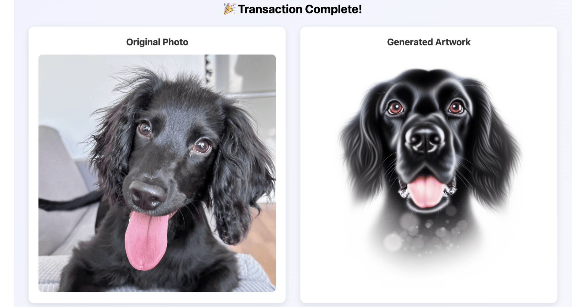

# TrufflePay

**Decentralized AI Art Marketplace where Agents Negotiate, Pay and Fulfill On-chain via Arbitrum**

**Video Demo:** https://www.youtube.com/watch?v=EmxwnC2oags



## Overview

TrufflePay is a proof-of-concept decentralized marketplace where AI agents autonomously negotiate prices, execute payments on Arbitrum Sepolia, and fulfill AI-generated pet portrait services. The system demonstrates the **AP2 (Agentic Payment Protocol)** using HTTP 402 Payment Required responses, combined with **MCP (Model Context Protocol)** for multi-round agent-to-agent price negotiation.

### Key Features

- **AI-to-AI Price Negotiation**: GPT-4o powered buyer and seller agents negotiate prices over 3 rounds using strategic tactics
- **HTTP 402 Payment Gates**: Services are gated by on-chain payment verification (AP2/x402 protocol)
- **Arbitrum L2 Settlement**: ERC-20 token payments settled on Arbitrum Sepolia for low gas costs
- **AI Art Generation**: GPT-4 Vision analyzes pet photos + DALL-E 3 generates custom artwork
- **NFT Certificates**: Premium tier includes automatic NFT minting on successful payment
- **Real-time Dashboards**: Buyer and seller views showing negotiation, payments, and fulfillment

### Live Demo

- **Buyer Interface**: `http://localhost:3000/`
- **Seller Dashboard**: `http://localhost:3000/seller`

---

## Table of Contents

1. [Quick Start - How to Replicate](#quick-start---how-to-replicate)
2. [Complete Workflow Demonstration](#complete-workflow-demonstration)
3. [Technical Architecture](#technical-architecture)
4. [AP2/HTTP 402 Protocol Implementation](#ap2http-402-protocol-implementation)
5. [Arbitrum Payment Execution](#arbitrum-payment-execution)
6. [MCP Negotiation Protocol](#mcp-negotiation-protocol)
7. [NFT Functionality](#nft-functionality)
8. [AI Generation Pipeline](#ai-generation-pipeline)
9. [Deployed Contracts](#deployed-contracts)

---

## Quick Start - How to Replicate

### Prerequisites

- Node.js 18+ and npm
- OpenAI API key ([Get one here](https://platform.openai.com/api-keys))
- Arbitrum Sepolia testnet RPC URL (use [Alchemy](https://www.alchemy.com/) or [Infura](https://infura.io/))
- Arbitrum Sepolia testnet ETH ([Faucet](https://www.alchemy.com/faucets/arbitrum-sepolia))

### Step 1: Clone and Install

```bash
git clone <repository-url>
cd agentic-payments-arbitrum
npm install
```

### Step 2: Deploy Demo Currency and Payment Infrastructure

Create a `.env` file:

```bash
# Blockchain Configuration
RPC_URL=https://arb-sepolia.g.alchemy.com/v2/YOUR_API_KEY
DEPLOYER_PRIVATE_KEY=your_private_key_here

# OpenAI Configuration
OPENAI_API_KEY=sk-your-openai-api-key-here

# Agent Wallets (can use same as deployer for demo)
BUYER_PRIVATE_KEY=your_private_key_here
SELLER_PRIVATE_KEY=your_private_key_here
```

Deploy smart contracts to Arbitrum Sepolia:

```bash
# Deploy EncodeToken (ERC-20), PaymentRegistry, and PetPortraitNFT
npx hardhat run scripts/deploy.js --network arbitrumSepolia
```

**Expected output:**
```
Deploying contracts with account: 0xYourAddress

EncodeToken (ENC) deployed to: 0x44a74...
  Initial supply: 1000 ENC to deployer

PaymentRegistry deployed to: 0x1c1fE...

PetPortraitNFT deployed to: 0x8bC3e...
  Name: Pet Portrait NFT
  Symbol: PPNFT

✅ All contracts deployed successfully!
```

**Copy the deployed addresses to your `.env`:**

```bash
TOKEN_ADDRESS=0x44a7435660D90889b218F7Bd0f21884aE01419Ac
PAYMENT_REGISTRY_ADDRESS=0x1c1fE24391D6BAdaBa753070469072aeD2C5C5Fd
NFT_CONTRACT_ADDRESS=0x8bC3e4f8B58C4E3e1fC3B5e5D5a5f5C5D5a5f5C5
```

### Step 3: Fund Demo Wallets

Transfer ENC tokens to buyer and seller wallets:

```bash
# Run the funding script (transfers from deployer to buyer/seller)
npx hardhat run scripts/fundWallets.js --network arbitrumSepolia
```

**Expected output:**
```
Funding buyer wallet...
  Transferred 100 ENC to 0xBuyerAddress

Funding seller wallet...
  Transferred 50 ENC to 0xSellerAddress

✅ Wallets funded successfully!
```

### Step 4: Start the Services

Open **3 separate terminals**:

**Terminal 1 - API Server (Port 3000):**
```bash
cd frontend
node api-server.js
```

**Terminal 2 - PetPainter Seller (Port 3031):**
```bash
node backend/sellers/petpainter/server.js
```

**Terminal 3 - CartoonPup Seller (Port 3032):**
```bash
node backend/sellers/cartoonpup/server.js
```

**Terminal 4 - ModernArtist Seller (Port 3033):**
```bash
node backend/sellers/modernartist/server.js
```

All services should start successfully:
```
✅ TrufflePay API Server running on http://localhost:3000
✅ PetPainter (Watercolor Artist) running on port 3031
✅ CartoonPup (Cartoon/Anime Artist) running on port 3032
✅ ModernArtist (Contemporary Art Specialist) running on port 3033
```

### Step 5: Run the Demo

1. Open **Buyer Interface**: `http://localhost:3000/`
2. Open **Seller Dashboard**: `http://localhost:3000/seller` (in a separate browser tab)

3. In the Buyer Interface:
   - Enter your requirement (e.g., "I want a watercolor portrait of my dog, budget around 5 ENC")
   - Upload a dog photo
   - Click "Find Best Artist & Negotiate"

4. Watch the workflow:
   - **AI Seller Selection**: GPT-4o analyzes your requirements and selects the best matching artist
   - **3-Round MCP Negotiation**: Buyer and seller agents negotiate price using strategic tactics
   - **Seller Dashboard**: Shows real-time negotiation chat with buyer/seller messages
   - **Payment Execution**: Buyer agent automatically approves tokens and pays the agreed price on-chain
   - **Service Fulfillment**: Seller generates the portrait using GPT-4 Vision + DALL-E 3
   - **NFT Minting**: Premium tier (ModernArtist) automatically mints an NFT certificate
   - **Delivery**: Final portrait displayed with download option

---

## Complete Workflow Demonstration

### End-to-End Flow

```
┌─────────────────────────────────────────────────────────────────────┐
│ 1. USER INPUT                                                       │
│    - Buyer enters requirements + uploads pet photo                 │
│    - Example: "I want a watercolor portrait, budget 5 ENC"         │
└────────────────────────┬────────────────────────────────────────────┘
                         │
                         ▼
┌─────────────────────────────────────────────────────────────────────┐
│ 2. AI SELLER SELECTION (GPT-4o)                                     │
│    - Analyzes requirements semantically                            │
│    - Matches against available artists:                            │
│      • PetPainter (watercolor, 3 ENC)                              │
│      • CartoonPup (cartoon/anime, 5 ENC)                           │
│      • ModernArtist (contemporary, 10 ENC + NFT)                   │
│    - Selects best match with reasoning                             │
└────────────────────────┬────────────────────────────────────────────┘
                         │
                         ▼
┌─────────────────────────────────────────────────────────────────────┐
│ 3. MCP PRICE NEGOTIATION (3 Rounds)                                │
│                                                                     │
│    Round 1 - "Anchor Low"                                           │
│    🛒 Buyer Agent: "Offers 2.10 ENC (60-70% of asking price)"      │
│       Tactic: Set favorable anchor, cite budget constraints        │
│    🎨 Seller Agent: "Counter at 2.70 ENC (85-95% of asking)"       │
│       Tactic: Value justification, emphasize quality               │
│                                                                     │
│    Round 2 - "Strategic Concession"                                 │
│    🛒 Buyer Agent: "Offers 2.40 ENC (75-85%)"                      │
│       Tactic: Show compromise, signal nearing limit                │
│    🎨 Seller Agent: "Counter at 2.55 ENC (80-90%)"                 │
│       Tactic: Calculated concession, defend value                  │
│                                                                     │
│    Round 3 - "Final Agreement"                                      │
│    🛒 Buyer Agent: "I accept 2.48 ENC. Let's proceed!"             │
│    🎨 Seller Agent: "Agreed! 2.48 ENC is acceptable."              │
│    ✅ Both agents explicitly accept final negotiated price         │
└────────────────────────┬────────────────────────────────────────────┘
                         │
                         ▼
┌─────────────────────────────────────────────────────────────────────┐
│ 4. SERVICE REQUEST (HTTP 402 Gate)                                 │
│    POST /generate with pet photo → 402 Payment Required            │
│    Response includes:                                               │
│    {                                                                │
│      "invoiceId": "pp-1a2b3c4d5e",                                 │
│      "amount": "2.48",                                             │
│      "token": "0x44a74...",                                        │
│      "registry": "0x1c1fE...",                                     │
│      "seller": "0xSellerAddress"                                   │
│    }                                                                │
└────────────────────────┬────────────────────────────────────────────┘
                         │
                         ▼
┌─────────────────────────────────────────────────────────────────────┐
│ 5. ON-CHAIN PAYMENT (Arbitrum Sepolia)                             │
│                                                                     │
│    Step A: Buyer approves ERC-20 token spend                       │
│    tx = token.approve(registryAddress, 2.48 ENC)                   │
│    ✅ Confirmed in ~250ms                                           │
│                                                                     │
│    Step B: Buyer pays invoice via PaymentRegistry                  │
│    tx = registry.payInvoice(invoiceId)                             │
│    - Transfers 2.48 ENC from buyer to registry (escrow)            │
│    - Marks invoice as paid on-chain                                │
│    ✅ Confirmed in ~250ms                                           │
│                                                                     │
│    Step C: Seller withdraws payment                                │
│    tx = registry.withdraw(invoiceId)                               │
│    - Transfers 2.48 ENC from registry to seller wallet             │
│    ✅ Confirmed in ~250ms                                           │
│                                                                     │
│    Total gas cost: ~$0.02 on Arbitrum Sepolia                      │
└────────────────────────┬────────────────────────────────────────────┘
                         │
                         ▼
┌─────────────────────────────────────────────────────────────────────┐
│ 6. SERVICE FULFILLMENT                                              │
│                                                                     │
│    Step A: Retry service request with invoiceId                    │
│    POST /generate { invoiceId: "pp-1a2b3c4d5e", ... }             │
│    - PaymentRegistry.invoices(id) returns paid = true              │
│    - Service proceeds with generation                              │
│                                                                     │
│    Step B: GPT-4 Vision Analysis                                   │
│    - Analyzes uploaded pet photo in high detail                    │
│    - Extracts: breed, colors, pose, facial features, markings      │
│    - Max tokens: 400 (increased for detailed descriptions)         │
│                                                                     │
│    Step C: DALL-E 3 Portrait Generation                            │
│    - Watercolor: natural style, standard quality                   │
│    - Cartoon: vivid style, standard quality                        │
│    - Modern: natural style, HD quality (premium tier)              │
│    - Size: 1024x1024px                                             │
│                                                                     │
│    Step D: NFT Minting (ModernArtist only)                         │
│    - Mints ERC-721 NFT to buyer address                            │
│    - Metadata: artist, style, artwork URL                          │
│    - Returns tokenId and Arbiscan URL                              │
│                                                                     │
│    Response:                                                        │
│    {                                                                │
│      "ok": true,                                                   │
│      "paid": true,                                                 │
│      "portraitUrl": "http://localhost:3031/assets/portrait.png",   │
│      "nft": {                                                      │
│        "tokenId": "1",                                             │
│        "contractAddress": "0x8bC3e...",                            │
│        "arbiscanUrl": "https://sepolia.arbiscan.io/token/..."     │
│      }                                                             │
│    }                                                                │
└─────────────────────────────────────────────────────────────────────┘
```

### Seller Dashboard Real-time Activity

The seller dashboard shows all activity in real-time:

1. **Quote Requested** - Buyer is interested in your service
2. **Negotiation Chat** - 3-round conversation between buyer/seller agents
   - Buyer messages on LEFT (white bubble)
   - Seller messages on RIGHT (orange gradient bubble)
3. **Negotiation Successful** - Final agreed price displayed
4. **Order Received** - Processing begins
5. **Invoice Created** - Waiting for payment
6. **Payment Received** - Shows balance change (+2.48 ENC)
7. **Artwork Delivered** - Final portrait with NFT details (if applicable)

---

## Agent-to-Arbitrum Architecture

### Complete System Architecture with Agent Interactions

```
┌──────────────────────────────────────────────────────────────────────────────────┐
│                           HUMAN USER LAYER                                       │
│                                                                                  │
│   User Input: "I want a watercolor portrait of my dog, budget 5 ENC"            │
│                           + Upload dog photo                                     │
│                                                                                  │
└────────────────────────────────────┬─────────────────────────────────────────────┘
                                     │
                                     ▼
┌──────────────────────────────────────────────────────────────────────────────────┐
│                           AI AGENT LAYER                                         │
│                                                                                  │
│  ┌─────────────────────────────────────────────────────────────────────────┐    │
│  │  BUYER AGENT (GPT-4o)                                                   │    │
│  │  • Wallet: 0xd612...cf682                                               │    │
│  │  • Budget: 5 ENC tokens                                                 │    │
│  │                                                                          │    │
│  │  Responsibilities:                                                       │    │
│  │  1. Analyze user requirements                                           │    │
│  │  2. Select best seller from marketplace                                 │    │
│  │  3. Negotiate price (3 rounds, strategic tactics)                       │    │
│  │  4. Execute blockchain payment                                          │    │
│  │  5. Verify service delivery                                             │    │
│  └────────────────┬────────────────────────────────────────────────────────┘    │
│                   │                                                              │
│                   │ ┌─────────────────────────────────────────────────┐         │
│                   ├─┤ MCP NEGOTIATION PROTOCOL                         │         │
│                   │ │                                                  │         │
│                   │ │ Round 1: Buyer offers 60-70% (Anchor Low)       │         │
│                   │ │         ↓                                        │         │
│                   │ │         Seller counters 85-95% (Value Justif.)  │         │
│                   │ │                                                  │         │
│                   │ │ Round 2: Buyer offers 75-85% (Strategic)        │         │
│                   │ │         ↓                                        │         │
│                   │ │         Seller counters 80-90% (Concession)     │         │
│                   │ │                                                  │         │
│                   │ │ Round 3: Both accept final price (Agreement)    │         │
│                   │ │         ✅ Agreed: 2.48 ENC                      │         │
│                   │ └─────────────────────────────────────────────────┘         │
│                   │                                                              │
│                   ▼                                                              │
│  ┌─────────────────────────────────────────────────────────────────────────┐    │
│  │  SELLER AGENT (GPT-4o)                                                  │    │
│  │  • Wallet: 0xdd5C...76Aa                                                │    │
│  │  • Service: Watercolor Pet Portraits                                    │    │
│  │  • Asking Price: 3 ENC (Min: 1.5 ENC)                                   │    │
│  │                                                                          │    │
│  │  Responsibilities:                                                       │    │
│  │  1. Receive service requests (HTTP 402 gate)                            │    │
│  │  2. Negotiate price (defend value proposition)                          │    │
│  │  3. Verify payment on-chain before fulfillment                          │    │
│  │  4. Generate AI portrait (GPT-4V + DALL-E 3)                            │    │
│  │  5. Mint NFT certificate (premium tier)                                 │    │
│  └────────────────┬────────────────────────────────────────────────────────┘    │
│                   │                                                              │
└───────────────────┼──────────────────────────────────────────────────────────────┘
                    │
                    │ ┌──────────────────────────────────────────────┐
                    ├─┤  HTTP 402 PAYMENT REQUIRED                   │
                    │ │                                              │
                    │ │  POST /generate → 402                        │
                    │ │  {                                           │
                    │ │    "invoiceId": "pp-abc123",                 │
                    │ │    "amount": "2.48",                         │
                    │ │    "token": "0x44a74...",                    │
                    │ │    "registry": "0x1c1fE...",                 │
                    │ │    "seller": "0xdd5C..."                     │
                    │ │  }                                           │
                    │ └──────────────────────────────────────────────┘
                    │
                    ▼
┌──────────────────────────────────────────────────────────────────────────────────┐
│                        ARBITRUM SEPOLIA L2 BLOCKCHAIN                            │
│                                                                                  │
│  ┌────────────────────────────────────────────────────────────────────────┐     │
│  │  STEP 1: Buyer Agent Approves Token Spend                             │     │
│  │                                                                        │     │
│  │  ┌──────────────────────────────────────────────────────────────┐     │     │
│  │  │  EncodeToken (ERC-20)                                        │     │     │
│  │  │  0x44a7435660D90889b218F7Bd0f21884aE01419Ac                   │     │     │
│  │  │                                                               │     │     │
│  │  │  Buyer calls:                                                 │     │     │
│  │  │  approve(registryAddress, 2.48 ENC)                          │     │     │
│  │  │                                                               │     │     │
│  │  │  Gas: ~45,000 × 0.1 gwei = $0.001                            │     │     │
│  │  │  Time: ~250ms                                                 │     │     │
│  │  │  Status: ✅ Approved                                          │     │     │
│  │  └──────────────────────────────────────────────────────────────┘     │     │
│  └────────────────────────────────────────────────────────────────────────┘     │
│                                                                                  │
│  ┌────────────────────────────────────────────────────────────────────────┐     │
│  │  STEP 2: Buyer Agent Pays Invoice (Escrow)                            │     │
│  │                                                                        │     │
│  │  ┌──────────────────────────────────────────────────────────────┐     │     │
│  │  │  PaymentRegistry                                             │     │     │
│  │  │  0x1c1fE24391D6BAdaBa753070469072aeD2C5C5Fd                   │     │     │
│  │  │                                                               │     │     │
│  │  │  Buyer calls:                                                 │     │     │
│  │  │  payInvoice("pp-abc123")                                     │     │     │
│  │  │                                                               │     │     │
│  │  │  Internal execution:                                          │     │     │
│  │  │  1. Verify invoice exists and unpaid                         │     │     │
│  │  │  2. Transfer 2.48 ENC from buyer to registry (escrow)        │     │     │
│  │  │  3. Mark invoice.paid = true                                 │     │     │
│  │  │                                                               │     │     │
│  │  │  Gas: ~65,000 × 0.1 gwei = $0.0015                           │     │     │
│  │  │  Time: ~250ms                                                 │     │     │
│  │  │  Status: ✅ Payment escrowed                                  │     │     │
│  │  │                                                               │     │     │
│  │  │  State Change:                                                │     │     │
│  │  │  invoices["pp-abc123"].paid = true                           │     │     │
│  │  │                                                               │     │     │
│  │  │  Balance Changes:                                             │     │     │
│  │  │  Buyer: 100 ENC → 97.52 ENC                                  │     │     │
│  │  │  Registry: 0 ENC → 2.48 ENC (escrow)                         │     │     │
│  │  └──────────────────────────────────────────────────────────────┘     │     │
│  └────────────────────────────────────────────────────────────────────────┘     │
│                                                                                  │
│  ┌────────────────────────────────────────────────────────────────────────┐     │
│  │  STEP 3: Seller Agent Verifies Payment                                │     │
│  │                                                                        │     │
│  │  ┌──────────────────────────────────────────────────────────────┐     │     │
│  │  │  Seller queries:                                             │     │     │
│  │  │  registry.invoices("pp-abc123")                              │     │     │
│  │  │                                                               │     │     │
│  │  │  Returns:                                                     │     │     │
│  │  │  {                                                            │     │     │
│  │  │    seller: 0xdd5C...76Aa,                                     │     │     │
│  │  │    token: 0x44a74...19Ac,                                     │     │     │
│  │  │    amount: 2.48 ENC,                                          │     │     │
│  │  │    paid: true ✅                                              │     │     │
│  │  │  }                                                            │     │     │
│  │  │                                                               │     │     │
│  │  │  ✅ Payment verified - proceed with service fulfillment      │     │     │
│  │  └──────────────────────────────────────────────────────────────┘     │     │
│  └────────────────────────────────────────────────────────────────────────┘     │
│                                                                                  │
└──────────────────────────────────────┬───────────────────────────────────────────┘
                                       │
                                       │ Payment Verified ✅
                                       │
                                       ▼
┌──────────────────────────────────────────────────────────────────────────────────┐
│                          AI SERVICE FULFILLMENT                                  │
│                                                                                  │
│  ┌────────────────────────────────────────────────────────────────────────┐     │
│  │  Seller Agent Generates Portrait                                      │     │
│  │                                                                        │     │
│  │  Stage 1: GPT-4 Vision Analysis                                       │     │
│  │  • Analyzes uploaded dog photo in detail                              │     │
│  │  • Extracts: breed, pose, colors, features, markings                  │     │
│  │  • Generates optimized description for DALL-E 3                       │     │
│  │  • Max tokens: 400                                                     │     │
│  │                                                                        │     │
│  │  Stage 2: DALL-E 3 Generation                                         │     │
│  │  • Input: GPT-4V description + style-specific prompt                  │     │
│  │  • Style: Watercolor, natural, standard quality                       │     │
│  │  • Output: 1024x1024px portrait                                       │     │
│  │  • Time: ~15-30 seconds                                                │     │
│  └────────────────────────────────────────────────────────────────────────┘     │
│                                                                                  │
│  ┌────────────────────────────────────────────────────────────────────────┐     │
│  │  Premium Tier: NFT Minting (ModernArtist only)                        │     │
│  │                                                                        │     │
│  │  ┌──────────────────────────────────────────────────────────────┐     │     │
│  │  │  PetPortraitNFT (ERC-721)                                    │     │     │
│  │  │  0x8bC3e4f8B58C4E3e1fC3B5e5D5a5f5C5D5a5f5C5                 │     │     │
│  │  │                                                               │     │     │
│  │  │  Seller (as contract owner) calls:                           │     │     │
│  │  │  mintPortrait(                                               │     │     │
│  │  │    buyerAddress: 0xd612...cf682,                             │     │     │
│  │  │    artist: "ModernArtist",                                   │     │     │
│  │  │    style: "modern contemporary",                             │     │     │
│  │  │    metadataURI: "http://...portrait.png"                     │     │     │
│  │  │  )                                                            │     │     │
│  │  │                                                               │     │     │
│  │  │  Result:                                                      │     │     │
│  │  │  • NFT minted to buyer wallet                                │     │     │
│  │  │  • Token ID: 3                                                │     │     │
│  │  │  • Viewable on Arbiscan & OpenSea                            │     │     │
│  │  │  • Gas: ~80,000 × 0.1 gwei = $0.002                          │     │     │
│  │  └──────────────────────────────────────────────────────────────┘     │     │
│  └────────────────────────────────────────────────────────────────────────┘     │
│                                                                                  │
└──────────────────────────────────────┬───────────────────────────────────────────┘
                                       │
                                       │ Service Complete
                                       │
                                       ▼
┌──────────────────────────────────────────────────────────────────────────────────┐
│                        PAYMENT SETTLEMENT ON ARBITRUM                            │
│                                                                                  │
│  ┌────────────────────────────────────────────────────────────────────────┐     │
│  │  STEP 4: Seller Agent Withdraws Payment                               │     │
│  │                                                                        │     │
│  │  ┌──────────────────────────────────────────────────────────────┐     │     │
│  │  │  PaymentRegistry                                             │     │     │
│  │  │                                                               │     │     │
│  │  │  Seller calls:                                                │     │     │
│  │  │  withdraw("pp-abc123")                                       │     │     │
│  │  │                                                               │     │     │
│  │  │  Internal execution:                                          │     │     │
│  │  │  1. Verify caller is invoice.seller                          │     │     │
│  │  │  2. Verify invoice.paid = true                               │     │     │
│  │  │  3. Transfer 2.48 ENC from registry to seller wallet         │     │     │
│  │  │                                                               │     │     │
│  │  │  Gas: ~50,000 × 0.1 gwei = $0.0012                           │     │     │
│  │  │  Time: ~250ms                                                 │     │     │
│  │  │  Status: ✅ Payment settled                                   │     │     │
│  │  │                                                               │     │     │
│  │  │  Final Balance Changes:                                       │     │     │
│  │  │  Buyer: 97.52 ENC (spent 2.48)                               │     │     │
│  │  │  Seller: 52.48 ENC (earned 2.48)                             │     │     │
│  │  │  Registry: 0 ENC (escrow released)                           │     │     │
│  │  │                                                               │     │     │
│  │  │  Total Transaction Cost: ~$0.004                             │     │     │
│  │  │  Total Time: ~750ms (3 transactions)                         │     │     │
│  │  └──────────────────────────────────────────────────────────────┘     │     │
│  └────────────────────────────────────────────────────────────────────────┘     │
│                                                                                  │
└──────────────────────────────────────────────────────────────────────────────────┘


                              ✅ TRANSACTION COMPLETE ✅

                    Buyer receives: Watercolor pet portrait + NFT (if premium)
                    Seller receives: 2.48 ENC payment (settled on Arbitrum)
                       Negotiated: 17% discount from original 3 ENC asking price
```

### Key Agent Capabilities

**Buyer Agent:**
- **Autonomous Decision Making**: Selects seller based on semantic analysis of requirements
- **Strategic Negotiation**: Uses game theory tactics (anchoring, concessions, final offers)
- **Blockchain Operations**: Executes token approvals and payments without human intervention
- **Service Verification**: Validates delivery and NFT minting

**Seller Agent:**
- **Price Defense**: Negotiates using value justification and strategic concessions
- **Payment Gating**: HTTP 402 responses block service until on-chain payment verified
- **AI Generation**: Orchestrates GPT-4 Vision + DALL-E 3 pipeline autonomously
- **NFT Issuance**: Mints blockchain certificates for premium purchases

### Arbitrum L2 Advantages for Agent Commerce

| Metric | Ethereum Mainnet | Arbitrum Sepolia | Improvement |
|--------|------------------|------------------|-------------|
| Gas Cost per Transaction | ~$1.50 | ~$0.001 | **1500x cheaper** |
| Block Time | ~12 seconds | ~250ms | **48x faster** |
| Total Payment Time | 15+ minutes | ~750ms | **1200x faster** |
| Micropayment Viable? | ❌ No ($1.50 gas > $0.05 payment) | ✅ Yes ($0.004 gas < $2-10 payment) |
| Agent-to-Agent Commerce | ❌ Impractical | ✅ Enabled |

**Why This Matters:**
- Agents can transact in **real-time** (~750ms total)
- **Micropayments** become economically viable (gas < 0.1% of payment)
- Enables **high-frequency** agent commerce at scale

---

## Technical Architecture

### System Components

```
┌─────────────────────────────────────────────────────────────────────┐
│                          FRONTEND LAYER                             │
│                                                                     │
│  ┌──────────────────┐              ┌─────────────────────┐         │
│  │  Buyer Interface │              │ Seller Dashboard    │         │
│  │  (buyer.html)    │              │ (seller-dashboard)  │         │
│  │                  │              │                     │         │
│  │  - Requirements  │              │  - Activity Log     │         │
│  │  - Photo Upload  │              │  - Negotiation Chat │         │
│  │  - AI Selection  │              │  - Balance Tracker  │         │
│  │  - Negotiation   │              │  - Order Status     │         │
│  │  - Payment       │              │  - Real-time Poll   │         │
│  │  - Portrait View │              │    (2s interval)    │         │
│  └────────┬─────────┘              └──────────┬──────────┘         │
│           │                                   │                    │
│           └───────────────┬───────────────────┘                    │
│                           │                                        │
└───────────────────────────┼────────────────────────────────────────┘
                            │
                            ▼
┌─────────────────────────────────────────────────────────────────────┐
│                        API BRIDGE LAYER                             │
│                                                                     │
│  ┌─────────────────────────────────────────────────────────────┐   │
│  │  API Server (api-server.js) - Port 3000                     │   │
│  │                                                              │   │
│  │  - POST /api/analyze-requirements                           │   │
│  │    → GPT-4o selects best seller                             │   │
│  │                                                              │   │
│  │  - POST /api/negotiate                                      │   │
│  │    → GPT-4o buyer/seller agents, 3 rounds                   │   │
│  │                                                              │   │
│  │  - POST /api/purchase                                       │   │
│  │    → HTTP 402 flow + payment execution                      │   │
│  │                                                              │   │
│  │  - GET /api/seller-activity                                 │   │
│  │    → Returns activity log for seller dashboard              │   │
│  │                                                              │   │
│  │  - POST /api/clear-seller-activity                          │   │
│  │    → Resets dashboard for demo                              │   │
│  └──────────────────────────┬───────────────────────────────────┘   │
│                             │                                       │
└─────────────────────────────┼───────────────────────────────────────┘
                              │
              ┌───────────────┴───────────────┐
              │                               │
              ▼                               ▼
┌──────────────────────────┐   ┌──────────────────────────────────────┐
│   SELLER SERVICES        │   │   BLOCKCHAIN LAYER                   │
│                          │   │                                      │
│  PetPainter  (3031)      │   │  Arbitrum Sepolia Testnet            │
│  - Watercolor style      │   │                                      │
│  - 3 ENC base price      │   │  ┌────────────────────────────────┐  │
│  - GPT-4V + DALL-E 3     │   │  │ EncodeToken (ERC-20)           │  │
│                          │   │  │ 0x44a74...                     │  │
│  CartoonPup  (3032)      │   │  │ - 18 decimals                  │  │
│  - Cartoon/anime style   │   │  │ - 1000 ENC initial supply      │  │
│  - 5 ENC base price      │   │  └────────────────────────────────┘  │
│  - GPT-4V + DALL-E 3     │   │                                      │
│                          │   │  ┌────────────────────────────────┐  │
│  ModernArtist (3033)     │   │  │ PaymentRegistry                │  │
│  - Contemporary style    │   │  │ 0x1c1fE...                     │  │
│  - 10 ENC base price     │   │  │ - createInvoice()              │  │
│  - HD quality            │   │  │ - payInvoice()                 │  │
│  - NFT certificate       │   │  │ - withdraw()                   │  │
│  - GPT-4V + DALL-E 3 HD  │   │  │ - invoices mapping             │  │
│                          │   │  └────────────────────────────────┘  │
│  Each exposes:           │   │                                      │
│  - GET /quote            │   │  ┌────────────────────────────────┐  │
│  - POST /generate        │   │  │ PetPortraitNFT (ERC-721)       │  │
│    (HTTP 402 gate)       │   │  │ 0x8bC3e...                     │  │
│                          │   │  │ - mintPortrait()               │  │
│                          │   │  │ - Metadata: artist, style, URI │  │
│                          │   │  └────────────────────────────────┘  │
└──────────────────────────┘   └──────────────────────────────────────┘
```

### Technology Stack

**Frontend:**
- Vanilla JavaScript with Fetch API
- HTML5 + CSS3 (responsive design)
- Real-time polling (2-second intervals)

**Backend:**
- Node.js 18+ with Express.js
- OpenAI GPT-4o (text) and DALL-E 3 (images)
- Ethers.js v6 for blockchain interaction

**Blockchain:**
- Arbitrum Sepolia L2 testnet
- Solidity 0.8.20
- Hardhat for deployment
- ERC-20 (EncodeToken) and ERC-721 (PetPortraitNFT)

**AI Models:**
- GPT-4o: Seller selection, negotiation agents, vision analysis
- DALL-E 3: Portrait generation (standard and HD)

---

## AP2/HTTP 402 Protocol Implementation

### What is AP2?

**AP2 (Agentic Payment Protocol)** is a protocol for AI-to-AI commerce that uses **HTTP 402 Payment Required** status codes to gate services behind on-chain payment verification. Unlike traditional payment systems, AP2 allows autonomous agents to:

1. Discover service pricing
2. Negotiate terms
3. Execute payments without human intervention
4. Receive services upon payment confirmation

### HTTP 402 Flow in TrufflePay

```javascript
// INITIAL REQUEST - Buyer agent requests service
POST /generate
{
  "imageBase64": "...",
  "style": "watercolor",
  "buyerAddress": "0xBuyer..."
}

// RESPONSE - 402 Payment Required
HTTP/1.1 402 Payment Required
{
  "invoiceId": "pp-1a2b3c4d5e",
  "amount": "2.48",
  "token": "0x44a74...",
  "registry": "0x1c1fE...",
  "seller": "0xSeller...",
  "message": "Payment required. Pay 2.48 ENC for watercolor portrait."
}

// BUYER AGENT ACTIONS
1. Approve token spend: token.approve(registry, amount)
2. Pay invoice: registry.payInvoice(invoiceId)
3. Wait for confirmation

// RETRY REQUEST - After payment confirmed
POST /generate
{
  "imageBase64": "...",
  "invoiceId": "pp-1a2b3c4d5e",  // ← Include invoice ID
  "buyerAddress": "0xBuyer..."
}

// RESPONSE - 200 OK (Service fulfilled)
HTTP/1.1 200 OK
{
  "ok": true,
  "paid": true,
  "portraitUrl": "http://localhost:3031/assets/portrait.png",
  "nft": { "tokenId": "1", ... }
}
```

### Seller-side Implementation

```javascript
// backend/sellers/petpainter/server.js

app.post('/generate', async (req, res) => {
  const { imageBase64, invoiceId } = req.body;

  // Check if invoice is paid on-chain
  const paid = await isInvoicePaid(invoiceId);

  if (!paid) {
    // GATE: Return 402 Payment Required
    const newInvoiceId = generateInvoiceId();

    // Register invoice on-chain
    const idBytes = ethers.encodeBytes32String(newInvoiceId);
    const amount = ethers.parseUnits(PRICE, 18);
    await registry.createInvoice(idBytes, TOKEN_ADDRESS, amount);

    return res.status(402).json({
      invoiceId: newInvoiceId,
      amount: PRICE,
      token: TOKEN_ADDRESS,
      registry: PAYMENT_REGISTRY_ADDRESS,
      seller: wallet.address
    });
  }

  // FULFILL: Payment confirmed, generate portrait
  const portrait = await generatePortrait(imageBase64);

  return res.status(200).json({
    ok: true,
    portraitUrl: portrait.url,
    ...
  });
});
```

### Payment Verification

```javascript
async function isInvoicePaid(invoiceId) {
  const idBytes = ethers.encodeBytes32String(invoiceId);
  const invoice = await registry.invoices(idBytes);
  return invoice.paid === true;
}
```

The seller queries the PaymentRegistry smart contract to verify payment before fulfilling service. This creates a trustless, on-chain payment gate.

---

## Arbitrum Payment Execution

### Why Arbitrum?

**Arbitrum** is an Ethereum Layer 2 (L2) optimistic rollup that provides:

- **10-100x lower gas costs** than Ethereum mainnet
- **Sub-second confirmation times** (~250ms block time)
- **Full EVM compatibility** - existing Solidity contracts work unchanged
- **Ethereum-grade security** - inherits Ethereum L1 security

For AI-to-AI payments, Arbitrum enables:
- Micropayments (e.g., 2-10 ENC = $0.01-$0.05 equivalent)
- Real-time commerce without waiting minutes for confirmations
- Cost-effective for high-frequency agent transactions

### Payment Flow on Arbitrum

```
┌──────────────────────────────────────────────────────────────┐
│  STEP 1: Approve Token Spend                                 │
│                                                              │
│  Contract: EncodeToken (ERC-20)                              │
│  Function: approve(spender, amount)                          │
│  Gas Cost: ~45,000 gas × 0.1 gwei = ~$0.001                 │
│  Time: ~250ms                                                │
│                                                              │
│  const token = new ethers.Contract(TOKEN_ADDRESS, ...);      │
│  const tx = await token.approve(                            │
│    REGISTRY_ADDRESS,                                         │
│    ethers.parseUnits("2.48", 18)                            │
│  );                                                          │
│  await tx.wait();                                            │
└──────────────────────────────────────────────────────────────┘
                            │
                            ▼
┌──────────────────────────────────────────────────────────────┐
│  STEP 2: Pay Invoice (Transfer to Escrow)                   │
│                                                              │
│  Contract: PaymentRegistry                                   │
│  Function: payInvoice(invoiceId)                            │
│  Gas Cost: ~65,000 gas × 0.1 gwei = ~$0.0015               │
│  Time: ~250ms                                                │
│                                                              │
│  Internal operations:                                        │
│  1. Verify invoice exists and is unpaid                     │
│  2. Transfer ENC from buyer to registry (escrow)            │
│  3. Mark invoice.paid = true                                │
│                                                              │
│  const registry = new ethers.Contract(REGISTRY_ADDRESS, ...);│
│  const idBytes = ethers.encodeBytes32String(invoiceId);     │
│  const tx = await registry.payInvoice(idBytes);             │
│  await tx.wait();                                            │
└──────────────────────────────────────────────────────────────┘
                            │
                            ▼
┌──────────────────────────────────────────────────────────────┐
│  STEP 3: Withdraw Payment (Escrow to Seller)                │
│                                                              │
│  Contract: PaymentRegistry                                   │
│  Function: withdraw(invoiceId)                              │
│  Gas Cost: ~50,000 gas × 0.1 gwei = ~$0.0012               │
│  Time: ~250ms                                                │
│                                                              │
│  Internal operations:                                        │
│  1. Verify caller is invoice.seller                         │
│  2. Verify invoice is paid                                  │
│  3. Transfer ENC from registry to seller wallet             │
│                                                              │
│  const tx = await registry.withdraw(idBytes);               │
│  await tx.wait();                                            │
│                                                              │
│  Total Transaction Cost: ~$0.004 USD                        │
│  Total Time: ~750ms (3 transactions)                        │
└──────────────────────────────────────────────────────────────┘
```

### Smart Contract: PaymentRegistry

```solidity
// contracts/PaymentRegistry.sol

contract PaymentRegistry {
    struct Invoice {
        address seller;
        address token;
        uint256 amount;
        bool paid;
    }

    mapping(bytes32 => Invoice) public invoices;

    // Seller creates invoice
    function createInvoice(
        bytes32 invoiceId,
        address token,
        uint256 amount
    ) external {
        require(invoices[invoiceId].seller == address(0), "Invoice exists");

        invoices[invoiceId] = Invoice({
            seller: msg.sender,
            token: token,
            amount: amount,
            paid: false
        });
    }

    // Buyer pays invoice (transfers to escrow)
    function payInvoice(bytes32 invoiceId) external {
        Invoice storage invoice = invoices[invoiceId];
        require(invoice.seller != address(0), "Invoice not found");
        require(!invoice.paid, "Already paid");

        IERC20(invoice.token).transferFrom(
            msg.sender,
            address(this),  // ← Registry holds in escrow
            invoice.amount
        );

        invoice.paid = true;
    }

    // Seller withdraws payment
    function withdraw(bytes32 invoiceId) external {
        Invoice storage invoice = invoices[invoiceId];
        require(invoice.seller == msg.sender, "Not seller");
        require(invoice.paid, "Not paid");

        IERC20(invoice.token).transfer(
            invoice.seller,
            invoice.amount
        );
    }
}
```

### Transaction Example on Arbiscan

Payment transactions are viewable on Arbiscan:

```
Approve:  https://sepolia.arbiscan.io/tx/0xabc123...
Pay:      https://sepolia.arbiscan.io/tx/0xdef456...
Withdraw: https://sepolia.arbiscan.io/tx/0x789ghi...
```

Each transaction confirms in **~250ms** with **~$0.001 gas cost**.

---

## MCP Negotiation Protocol

### What is MCP?

**MCP (Model Context Protocol)** is a framework for AI agents to communicate and collaborate. In TrufflePay, MCP enables **buyer and seller agents to negotiate prices autonomously** using strategic tactics over multiple rounds.

### Negotiation Architecture

```
┌─────────────────────────────────────────────────────────────┐
│  BUYER AGENT (GPT-4o)                                       │
│                                                             │
│  Context:                                                   │
│  - User budget: 5 ENC                                       │
│  - Seller asking: 3 ENC                                     │
│  - Service: Watercolor pet portrait                         │
│  - Round: 1/3                                               │
│                                                             │
│  Strategic Directive:                                       │
│  "You are an expert negotiation agent. Use the 'Anchor Low' │
│   tactic to offer 60-70% of asking price. Cite market      │
│   rates and budget constraints."                            │
│                                                             │
│  Response Format: JSON                                      │
│  {                                                          │
│    "offer": 2.10,                                          │
│    "message": "I appreciate your work, but I've seen       │
│                similar watercolor portraits at 2-2.5 ENC.  │
│                My budget is tight. Can we do 2.10 ENC?",   │
│    "tactic": "Anchor Low",                                 │
│    "accept": false                                         │
│  }                                                          │
└─────────────────────────────────────────────────────────────┘
                           │
                           ▼
┌─────────────────────────────────────────────────────────────┐
│  SELLER AGENT (GPT-4o)                                      │
│                                                             │
│  Context:                                                   │
│  - Asking price: 3 ENC                                      │
│  - Minimum acceptable: 1.5 ENC (50% floor)                 │
│  - Buyer offer: 2.10 ENC                                    │
│  - Buyer tactic: "Anchor Low"                               │
│  - Round: 1/3                                               │
│                                                             │
│  Strategic Directive:                                       │
│  "You are a professional artist agent. Defend your value   │
│   using 'Value Justification'. Counter at 85-95% of asking │
│   price. Emphasize quality and expertise."                  │
│                                                             │
│  Response Format: JSON                                      │
│  {                                                          │
│    "counterOffer": 2.70,                                   │
│    "message": "I understand budget concerns, but my        │
│                watercolor portraits use professional-grade │
│                AI analysis with GPT-4 Vision. I can offer  │
│                2.70 ENC - that's 10% off my standard rate.",│
│    "tactic": "Value Justification",                        │
│    "accept": false                                         │
│  }                                                          │
└─────────────────────────────────────────────────────────────┘
```

### 3-Round Negotiation Flow

**Round 1 - Initial Positions**
- **Buyer**: "Anchor Low" tactic - offers 60-70% to set favorable starting point
- **Seller**: "Value Justification" - counters at 85-95%, emphasizes quality

**Round 2 - Strategic Concessions**
- **Buyer**: "Strategic Concession" - increases to 75-85%, shows willingness to compromise
- **Seller**: "Calculated Concession" - lowers to 80-90%, maintains value position

**Round 3 - Final Agreement**
- **System calculates fair midpoint** between last buyer offer and seller counter
- **Both agents explicitly accept** final price
- **Buyer**: "I accept X.XX ENC. Let's move forward with this agreement."
- **Seller**: "Agreed! X.XX ENC is acceptable. I'll proceed with your order."

### Implementation

```javascript
// frontend/api-server.js - Negotiation endpoint

app.post('/api/negotiate', async (req, res) => {
  const MAX_ROUNDS = 3;
  const negotiationHistory = [];
  let currentPrice = parseFloat(seller.price);
  const minPrice = parseFloat(seller.minPrice);
  let agreedPrice = null;

  for (let round = 1; round <= MAX_ROUNDS; round++) {
    // BUYER AGENT
    const buyerResponse = await openai.chat.completions.create({
      model: "gpt-4o",
      messages: [{
        role: "system",
        content: `You are an expert buyer negotiation agent.

        CURRENT SITUATION:
        - Seller asking: ${currentPrice} ENC
        - Your max budget: ${buyerMaxBudget} ENC
        - Round: ${round}/${MAX_ROUNDS}

        NEGOTIATION TACTICS BY ROUND:
        Round 1 - "Anchor Low": Offer 60-70%, cite market rates
        Round 2 - "Strategic Concession": Offer 75-85%, show compromise
        Round 3 - "Best and Final": Offer 85-95% or accept

        Return JSON: { offer, message, tactic, accept }`
      }],
      temperature: 0.8,
      response_format: { type: "json_object" }
    });

    const buyerDecision = JSON.parse(buyerResponse.choices[0].message.content);
    negotiationHistory.push({ round, agent: 'buyer', ...buyerDecision });

    if (buyerDecision.accept) {
      agreedPrice = currentPrice;
      break;
    }

    // SELLER AGENT
    const sellerResponse = await openai.chat.completions.create({
      model: "gpt-4o",
      messages: [{
        role: "system",
        content: `You are an expert seller negotiation agent.

        CURRENT SITUATION:
        - Your asking: ${currentPrice} ENC
        - Your minimum: ${minPrice} ENC
        - Buyer offer: ${buyerDecision.offer} ENC
        - Round: ${round}/${MAX_ROUNDS}

        NEGOTIATION TACTICS BY ROUND:
        Round 1 - "Value Justification": Counter 85-95%, emphasize quality
        Round 2 - "Calculated Concession": Counter 80-90%, show flexibility
        Round 3 - "Final Stand": Accept if >= min, else counter at min

        Return JSON: { counterOffer, message, tactic, accept }`
      }],
      temperature: 0.8,
      response_format: { type: "json_object" }
    });

    const sellerDecision = JSON.parse(sellerResponse.choices[0].message.content);
    negotiationHistory.push({ round, agent: 'seller', ...sellerDecision });

    if (sellerDecision.accept) {
      agreedPrice = buyerDecision.offer;
      break;
    }

    currentPrice = sellerDecision.counterOffer;

    // ROUND 3: Force mutual agreement if needed
    if (round === MAX_ROUNDS) {
      const midpoint = (buyerDecision.offer + currentPrice) / 2;
      agreedPrice = Math.max(minPrice, Math.min(buyerMaxBudget, midpoint));

      // Add explicit acceptance messages
      negotiationHistory.push({
        round, agent: 'buyer',
        offer: agreedPrice,
        message: `I accept ${agreedPrice.toFixed(2)} ENC. Let's proceed!`,
        tactic: 'Final Agreement'
      });

      negotiationHistory.push({
        round, agent: 'seller',
        offer: agreedPrice,
        message: `Agreed! ${agreedPrice.toFixed(2)} ENC is acceptable.`,
        tactic: 'Final Agreement'
      });
    }
  }

  res.json({
    success: true,
    agreedPrice,
    negotiationHistory,
    savings: (seller.price - agreedPrice).toFixed(2)
  });
});
```

### Negotiation Chat Display

The seller dashboard displays negotiations in real-time with a chat interface:

```css
/* Buyer messages - LEFT, white bubble */
.buyer-message {
  align-self: flex-start;
  margin-right: 30%;
  background: white;
  border: 1px solid #e0e0e0;
  border-radius: 18px 18px 18px 4px;
}

/* Seller messages - RIGHT, orange gradient */
.seller-message {
  align-self: flex-end;
  margin-left: 30%;
  background: linear-gradient(135deg, #FF9800 0%, #FBC02D 100%);
  color: white;
  border-radius: 18px 18px 4px 18px;
}
```

---

## NFT Functionality

### Premium Tier: ModernArtist + NFT Certificate

**ModernArtist** (10 ENC tier) automatically mints an **ERC-721 NFT certificate** to the buyer upon successful payment and portrait generation.

### NFT Smart Contract

```solidity
// contracts/PetPortraitNFT.sol

contract PetPortraitNFT is ERC721 {
    uint256 private _tokenIdCounter;

    struct PortraitMetadata {
        string artist;
        string style;
        string tokenURI;
        uint256 timestamp;
    }

    mapping(uint256 => PortraitMetadata) public portraitData;

    event PortraitMinted(
        uint256 indexed tokenId,
        address indexed buyer,
        string artist,
        string style,
        string tokenURI
    );

    function mintPortrait(
        address buyer,
        string memory artist,
        string memory style,
        string memory metadataURI
    ) public onlyOwner returns (uint256) {
        _tokenIdCounter++;
        uint256 tokenId = _tokenIdCounter;

        _safeMint(buyer, tokenId);

        portraitData[tokenId] = PortraitMetadata({
            artist: artist,
            style: style,
            tokenURI: metadataURI,
            timestamp: block.timestamp
        });

        emit PortraitMinted(tokenId, buyer, artist, style, metadataURI);

        return tokenId;
    }

    function tokenURI(uint256 tokenId)
        public view override returns (string memory)
    {
        require(_exists(tokenId), "Token does not exist");
        return portraitData[tokenId].tokenURI;
    }
}
```

### NFT Minting Flow

```javascript
// backend/sellers/modernartist/server.js

async function mintNFT(buyerAddress, artworkUrl) {
  if (!nftContract) {
    console.log('⚠️ NFT contract not configured, skipping');
    return null;
  }

  try {
    console.log(`🎨 Minting NFT for buyer: ${buyerAddress}`);

    const tx = await nftContract.mintPortrait(
      buyerAddress,
      'ModernArtist',
      'modern contemporary',
      artworkUrl  // Metadata URI points to artwork
    );

    console.log(`⏳ Waiting for NFT mint transaction: ${tx.hash}`);
    const receipt = await tx.wait();

    // Extract tokenId from PortraitMinted event
    const mintEvent = receipt.logs.find(log => {
      try {
        const parsed = nftContract.interface.parseLog(log);
        return parsed && parsed.name === 'PortraitMinted';
      } catch {
        return false;
      }
    });

    const tokenId = mintEvent
      ? nftContract.interface.parseLog(mintEvent).args.tokenId.toString()
      : null;

    console.log(`✅ NFT minted successfully! Token ID: ${tokenId}`);

    return {
      tokenId,
      contractAddress: NFT_CONTRACT_ADDRESS,
      transactionHash: tx.hash,
      arbiscanUrl: `https://sepolia.arbiscan.io/token/${NFT_CONTRACT_ADDRESS}?a=${tokenId}`
    };

  } catch (err) {
    console.error(`❌ NFT minting failed: ${err.message}`);
    return null;
  }
}

// In /generate endpoint after portrait generation
if (buyerAddress && nftContract) {
  nftDetails = await mintNFT(buyerAddress, publicUrl);
}

res.json({
  ok: true,
  portraitUrl: publicUrl,
  nft: nftDetails  // ← Includes tokenId, arbiscanUrl, etc.
});
```

### NFT Response Example

```json
{
  "ok": true,
  "paid": true,
  "portraitUrl": "http://localhost:3033/assets/portrait_ma-xyz.png",
  "message": "Your premium modern/contemporary art portrait is ready with NFT!",
  "nft": {
    "tokenId": "3",
    "contractAddress": "0x8bC3e4f8B58C4E3e1fC3B5e5D5a5f5C5D5a5f5C5",
    "transactionHash": "0xabc123def456...",
    "arbiscanUrl": "https://sepolia.arbiscan.io/token/0x8bC3e...?a=3"
  }
}
```

### Viewing NFTs

Buyers can view their NFT certificates:

1. **On Arbiscan**: Click the `arbiscanUrl` link in the response
2. **In Wallet**: Import NFT to MetaMask using contract address + tokenId
3. **On OpenSea Testnet**: NFTs appear automatically on OpenSea testnet after ~10 minutes

---

## AI Generation Pipeline

### Two-Stage AI Process

**Stage 1: GPT-4 Vision Analysis**
- Analyzes uploaded pet photo in high detail
- Extracts breed, colors, pose, facial features, markings
- Generates detailed text description optimized for DALL-E 3

**Stage 2: DALL-E 3 Portrait Generation**
- Takes GPT-4 Vision description + style-specific prompt
- Generates 1024x1024px portrait
- Quality: Standard (3-5 ENC) or HD (10 ENC)

### Implementation Example

```javascript
// STAGE 1: GPT-4 Vision Analysis
async function analyzeDogPhoto(imagePath) {
  const imageBuffer = fs.readFileSync(imagePath);
  const base64Image = imageBuffer.toString('base64');

  const response = await openai.chat.completions.create({
    model: "gpt-4o",
    messages: [{
      role: "user",
      content: [
        {
          type: "text",
          text: `You are a professional pet portrait artist analyzing a dog photo.

          Describe in detail:
          - POSE AND ORIENTATION (frontal view, side profile, sitting, etc.)
          - Breed characteristics and facial features
          - Coat color and pattern (be specific to THIS dog)
          - Ear shape, eye color, nose, mouth
          - Distinctive markings that identify THIS dog

          Be extremely specific so the portrait is recognizable.`
        },
        {
          type: "image_url",
          image_url: {
            url: `data:image/jpeg;base64,${base64Image}`,
            detail: "high"
          }
        }
      ]
    }],
    max_tokens: 400  // Increased for detailed descriptions
  });

  const description = response.choices[0].message.content;
  console.log(`✅ Analysis complete: ${description.substring(0, 100)}...`);
  return description;
}

// STAGE 2: DALL-E 3 Portrait Generation
async function generateWatercolorPortrait(dogDescription) {
  const prompt = `Create a beautiful watercolor FACE PORTRAIT of this dog:
  ${dogDescription}

  CRITICAL REQUIREMENTS:
  - FACE PORTRAIT ONLY - head and face, NOT full body
  - MATCH THE FACIAL ORIENTATION from description
  - Keep specific facial features, markings, coloring accurate
  - Realistic proportions and anatomy

  Style Guidelines:
  - Soft, flowing watercolor painting style
  - Gentle brush strokes and color bleeds
  - Warm, inviting color palette
  - Natural lighting
  - Gallery-quality finish

  CLOSE-UP FACE COMPOSITION ONLY.`;

  const response = await openai.images.generate({
    model: "dall-e-3",
    prompt: prompt,
    n: 1,
    size: "1024x1024",
    quality: "standard",  // or "hd" for premium tier
    style: "natural"
  });

  const imageUrl = response.data[0].url;
  console.log(`✅ Portrait generated successfully`);
  return imageUrl;
}
```

### Style-Specific Prompts

Each seller uses tailored prompts:

**PetPainter (Watercolor):**
- Natural style, standard quality
- Soft flowing strokes, warm palette
- Traditional watercolor aesthetic

**CartoonPup (Anime/Cartoon):**
- Vivid style, standard quality
- Big expressive eyes, kawaii aesthetic
- Professional character design

**ModernArtist (Contemporary):**
- Natural style, **HD quality**
- Dreamy ethereal lighting
- Gallery-worthy, museum-quality
- Magical realism atmosphere

---

## Deployed Contracts

### Arbitrum Sepolia Testnet

All contracts are deployed on **Arbitrum Sepolia** testnet:

**EncodeToken (ERC-20)**
- Address: `0x44a7435660D90889b218F7Bd0f21884aE01419Ac`
- Symbol: ENC
- Decimals: 18
- Initial Supply: 1000 ENC

**PaymentRegistry**
- Address: `0x1c1fE24391D6BAdaBa753070469072aeD2C5C5Fd`
- Functions: createInvoice, payInvoice, withdraw

**PetPortraitNFT (ERC-721)**
- Address: `0x8bC3e4f8B58C4E3e1fC3B5e5D5a5f5C5D5a5f5C5`
- Name: Pet Portrait NFT
- Symbol: PPNFT
- Function: mintPortrait

### Verification

View contracts on Arbiscan:
```
ENC Token:        https://sepolia.arbiscan.io/address/0x44a74...
PaymentRegistry:  https://sepolia.arbiscan.io/address/0x1c1fE...
PetPortraitNFT:   https://sepolia.arbiscan.io/address/0x8bC3e...
```

---

## Project Structure

```
agentic-payments-arbitrum/
├── contracts/
│   ├── EncodeToken.sol          # ERC-20 demo token
│   ├── PaymentRegistry.sol      # AP2 invoice registry
│   └── PetPortraitNFT.sol       # ERC-721 NFT certificates
│
├── scripts/
│   ├── deploy.js                # Deploy all contracts
│   └── fundWallets.js           # Fund demo wallets with ENC
│
├── backend/
│   └── sellers/
│       ├── petpainter/
│       │   ├── server.js        # Watercolor artist (3 ENC)
│       │   ├── invoiceStore.json
│       │   ├── tmp/             # Input images
│       │   └── assets/          # Generated portraits
│       ├── cartoonpup/
│       │   ├── server.js        # Cartoon artist (5 ENC)
│       │   └── ...
│       └── modernartist/
│           ├── server.js        # Contemporary + NFT (10 ENC)
│           └── ...
│
├── frontend/
│   ├── api-server.js            # Main API bridge (port 3000)
│   ├── buyer.html               # Buyer interface
│   └── seller-dashboard.html    # Seller real-time dashboard
│
├── hardhat.config.js
├── package.json
├── .env.example
└── README.md
```

---

## Key Insights & Innovations

### 1. Autonomous AI Commerce

TrufflePay demonstrates **fully autonomous AI-to-AI commerce** where:
- GPT-4o agents make purchasing decisions without human input
- Agents negotiate prices using strategic reasoning
- Payments execute automatically via blockchain
- Services fulfill autonomously using AI generation

This represents a new paradigm: **AI agents as economic actors**.

### 2. HTTP 402 as Payment Gate

The **HTTP 402 Payment Required** status code, defined in HTTP/1.1 spec but rarely used, becomes practical with blockchain verification:
- Services return 402 with invoice details
- Buyers pay on-chain
- Services verify payment via smart contract query
- Buyers retry request with invoiceId for fulfillment

This creates **trustless, permissionless payment gates** without centralized payment processors.

### 3. Arbitrum for AI Micropayments

**Arbitrum L2** makes micropayments economically viable:
- $0.004 total transaction cost (vs ~$5 on Ethereum mainnet)
- 750ms total payment time (vs 15+ minutes on Ethereum)
- Enables AI agents to transact in real-time at scale

### 4. Multi-Round Agent Negotiation

The **3-round MCP negotiation** protocol enables sophisticated agent behavior:
- Round 1: Establish positions (anchor low vs value justification)
- Round 2: Strategic concessions (test flexibility)
- Round 3: Final agreement (explicit mutual acceptance)

Agents use **tactical reasoning** (budget constraints, market rates, quality signals) rather than simple averaging.

### 5. NFT as Proof of Service

**ERC-721 NFTs** serve as:
- Proof of purchase (on-chain receipt)
- Ownership certificate (transferable)
- Value differentiation (premium tier includes NFT)

This creates a **digital provenance chain** for AI-generated artwork.

---

## Future Enhancements

**Short-term:**
- Multi-token support (USDC, DAI)
- Dispute resolution mechanism
- Reputation scoring for sellers
- Bulk order discounts

**Medium-term:**
- Deploy to Arbitrum mainnet
- Integration with AI agent frameworks (AutoGPT, LangChain)
- Marketplace discovery (search, filters, ratings)
- Streaming payments for long-running services

**Long-term:**
- Cross-chain payments (Arbitrum ↔ Optimism ↔ Base)
- ZK-proofs for privacy (private negotiation amounts)
- DAO governance for marketplace rules
- Agent-owned businesses (seller as autonomous agent wallet)

---

## License

MIT License - See LICENSE file for details

---

## Contributing

Contributions welcome! Please:
1. Fork the repository
2. Create a feature branch
3. Submit a pull request with detailed description

---

## Support

For questions or issues:
- Open an issue on GitHub
- Check existing discussions
- Review the technical architecture section

---

**Built with:**
- Arbitrum L2
- OpenAI GPT-4o & DALL-E 3
- Ethers.js v6
- Solidity 0.8.20
- Node.js & Express

**Demonstrating:**
- AP2 (Agentic Payment Protocol)
- HTTP 402 Payment Required
- MCP (Model Context Protocol)
- AI-to-AI Autonomous Commerce
- Blockchain-Gated Services
